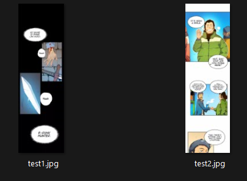
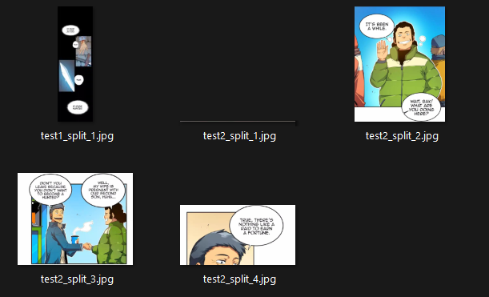
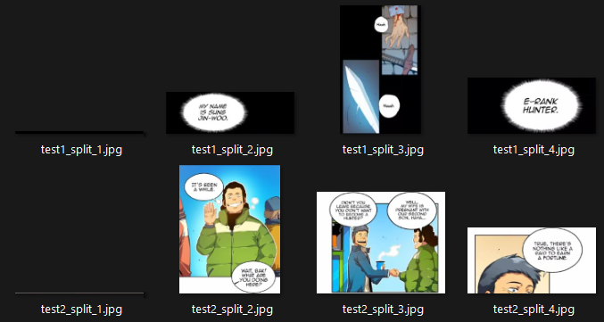

#  Manhwa Splitter
## Description
A simple Python script to horizontally split long strip of comic image (mostly from **Manhwa**). This script processes images by identifying and splitting them at rows that are predominantly white or black, which are common property of Manhwas. This should help readers have better experience on mobile devices. It can also be used to automate the splitting of other images where you might find its usage necessary.

### Features
* Splits images at rows that are entirely white or black.
* Adjustable tolerance parameter for flexibility.
* Supports multiple image formats: *PNG, JPG, JPEG, BMP, WEBP*.
* Processes images within a specified folder, including subfolders (good for comic chapters).

### Requirements
* Python 3.x
* Pillow (PIL)
* NumPy

You can install the necessary dependencies using:
```
pip install Pillow numpy
```
## Usage
#### Command-line Arguments
* `-i` or `--input` : Path to the input folder containing images. ***Required.***
* `-o` or `--output` : Path to the output folder where processed images will be saved. ***Required.***
* `-t` or `--tolerance` : Tolerance level (default is 10). *Optional.*
* `-m` or `--min-height` : Minimum height of split images to include (default: no limit). *Optional.*

#### Example Usage
```
python comicsplit.py -i path/to/input/folder -o path/to/output/folder -t 10
```
This should process all images within the input folder and its subfolders, splits them, with a tolerance of 10.
#### Sample Images
##### *Input Images:*
Below are sample input images (taken from Solo Leveling)



##### *Output Images:*
Below are output images with different tolerance level, **10** and **14**, respectively. *Notice how test1.jpg didn't really split when the tolerance level is 10.*

 


#### Output
The script will save the split images in the specified output folder. Each split part of an image will have a suffix *_split_X* added to its original filename.

### Notes
* The script will create the output directory structure if it doesn't already exist.
* It processes all images recursively in the specified input folder.
* Undesirable image "fragments" can be outputted.

# License
This project is licensed under the MIT License.
